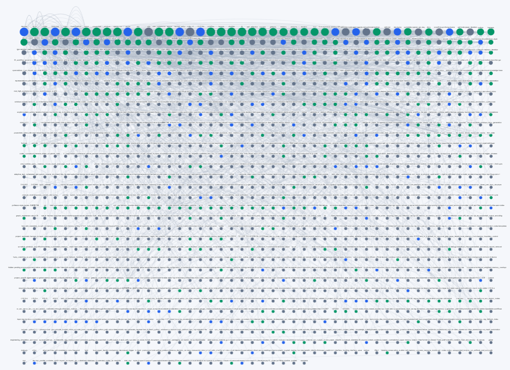

# AI-brain

**语言:** [English](README.md) | 简体中文

**仓库地址:** [LLK-LL/AI-brain](https://github.com/LLK-LL/AI-brain)

**AI-brain 是一个面向个人用户的轻量级本地 AI 记忆系统。**

它不是一个笨重的企业级 agent 平台，也不是单纯把聊天记录丢进向量数据库。AI-brain 更像是你给 AI 准备的“个人大脑硬盘”：把你的经验、偏好、规则、技能、工作流和历史教训持续整理起来，让 AI 在下一次工作时能真正记住你、理解你、复用你过去训练出来的方法。

如果你经常使用 Codex 类 agent、Claude、ChatGPT、本地 agent 或 MCP 记忆工具，AI-brain 解决的是一个非常常见的问题：

> AI 在一次任务里越用越聪明，但下次打开又像重新开始。

AI-brain 会把这种脆弱的本地状态，整理成可审查、可恢复、可迁移的个人记忆库。

## 为什么需要 AI-brain？

现在市面上的 AI 记忆系统大致分几类：

| 类型 | 代表项目 | 更适合谁 | 对个人用户的常见不足 |
| --- | --- | --- | --- |
| 通用记忆 API | Mem0 | 开发者、AI 应用、SaaS 产品 | 强大但偏产品/API 集成，对普通个人用户仍有门槛 |
| Stateful Agent 框架 | Letta / MemGPT | 构建长期运行 agent 的开发者 | 更像 agent 开发框架，不只是个人记忆库 |
| 企业级图谱记忆 | Zep | 企业 agent、客服、业务系统 | 强调规模、延迟、合规，个人使用偏重 |
| 本地 MCP 记忆层 | OpenMemory 等 | 多客户端共享记忆的用户 | 主要解决存取记忆，不一定管理技能、规则和工作流资产 |
| 个人知识库 RAG | Obsidian AI、Khoj 等 | 笔记问答、文档检索 | 更偏资料检索，不一定沉淀 AI 行为规则和可复用技能 |

AI-brain 选择了一条更适合个人用户的路线。

它不追求搭建一个巨大的 AI 平台，而是把你本地已经训练出来的 AI 经验变成可保存、可检索、可迁移、可迭代的个人资产。

## 核心优势

### 1. 轻量，适合个人训练和长期使用

AI-brain 围绕本地文件、结构化导出、Git 版本管理和定期同步工作。

- 本地优先，个人可控。
- 文件结构清晰，打开就能看。
- 可以用 GitHub 做远程备份。
- 不需要企业级记忆系统。
- 适合作为长期个人 AI 训练循环。

这让它特别适合个人用户日常使用：开发者、科研人员、写作者、自动化玩家，以及所有希望 AI 越用越懂自己的人。

### 2. 不只记聊天，还记“怎么做事”

很多记忆系统主要保存事实、摘要或对话片段。AI-brain 更关注 AI 使用过程中的操作资产：

- `memories/`：事实、经验、决策、修复方法、反思记录；
- `rules/`：AI 应该遵守的行为规则；
- `skills/`：可复用的任务流程和 Codex skills；
- `agent-skills/`：不同 agent 层的技能配置；
- `preferences/`：脱敏后的偏好和配置快照；
- `templates/`：用于记忆、规则、技能和工作流迭代的治理模板；
- `manifest.json`：记录每次同步的来源、时间和安全处理方式。

换句话说，AI-brain 保存的不只是 AI 学到了什么，还保存了你是如何训练 AI 工作的。

### 3. 可审计、可回滚、可迁移

隐藏在数据库里的记忆很方便，但时间一长容易变成黑箱：你不知道它记了什么，也不知道它什么时候学坏了。

AI-brain 把系统层和数据层分开：

```text
memory-system/      # 同步脚本、调度方式、架构说明、治理说明
memory-data/        # 记忆、规则、技能、偏好、模板、快照
```

因为记忆状态是版本化的，你可以：

- 查看 AI 到底记住了什么；
- 对比不同时间的记忆变化；
- 回滚到更早的快照；
- 把整套记忆迁移到另一台机器；
- 分享或归档自己的 AI 训练资产。

### 4. 默认具备隐私与安全意识

AI-brain 的同步流程默认是保守的。它会排除缓存、日志、临时文件、数据库中间写入文件等不适合上传的内容，也会对偏好和配置快照中的敏感关键词进行脱敏，例如：

- `token`
- `password`
- `secret`
- `api_key`
- `credential`
- `cookie`
- `session`

如果你要公开仓库，仍然建议先人工审查第一次同步结果。但 AI-brain 从设计上就把个人安全放在重要位置。

## 支持的 Agent 平台

AI-brain 当前最强的是 Codex + 本地 MCP 记忆生态，但它的存储方式本身是平台无关的。只要某个 agent 能读取 Markdown、规则文件、JSON 导出、本地文件或 MCP 工具，就可以把 AI-brain 当成个人记忆来源。

| 平台 | 当前支持程度 | AI-brain 提供什么 | 配置方法 |
| --- | --- | --- | --- |
| Codex CLI / Codex Desktop / Codex App | 原生支持 | `AGENTS.md`、`.codex/memories`、`.codex/rules`、`.codex/skills`、`.codex/templates`、脱敏后的 `.codex/config.toml` 快照 | 将全局指导放在 `~/.codex/AGENTS.md`，项目指导放在仓库 `AGENTS.md`，可复用流程做成 Codex skills，然后运行 `memory-system/scripts/sync-memory-library.ps1` 同步本地 Codex 状态。 |
| VS Code / Cursor / Windsurf 中的 Codex | 通过 Codex 扩展原生支持 | 同一套 Codex 记忆、规则和技能层 | 在编辑器中安装/使用 Codex，继续维护 `AGENTS.md` 和 `.codex/skills` 结构，然后从共享的本地 Codex home 同步 AI-brain。 |
| `.agents` 技能生态 | 原生支持 | 用于跨 agent 复用的 `agent-skills/` 技能层和平台路由 | 将共享技能放到 `~/.agents/skills`，运行 AI-brain 同步脚本后会复制到 `memory-data/.../agent-skills`。 |
| MCP 记忆工具 / Total Agent Memory 类导出 | 原生导出与归档支持 | `memory-data/.../exports` 下的结构化记忆导出 | 将 MCP memory 导出或备份到配置好的本地备份目录，再由 AI-brain 收集最新导出，并在 `manifest.json` 中记录来源。 |
| Claude Code / Claude Desktop | 易适配 | 长期记忆、规则、技能和工作流笔记可以转换成 Claude 指令或 MCP 记忆 | 将 AI-brain 的高层规则整理进 `CLAUDE.md`，项目级规则放进 `.claude/rules/`，并通过 MCP server 或 Markdown 文件暴露记忆导出。 |
| Cursor | 易适配 | 项目约定、工作流规则、可复用任务指导 | 将 AI-brain 中的规则或精选记忆转换成 Cursor Rules，例如 `.cursor/rules/` 项目规则、Cursor 设置里的 User Rules，或平台支持的 `AGENTS.md`。 |
| Continue | 易适配 | Rules、prompts、tools 和 MCP 可读的记忆导出 | 将 AI-brain 提炼出的规则加入 Continue 的本地/全局配置，并在 Continue 的 tools/MCP 配置中连接记忆检索 MCP server。 |
| Windsurf / Cascade | 易适配 | Memories、Rules 和可选的 MCP 检索 | 将 AI-brain 中的精选规则转换为 Windsurf/Cascade Rules，将稳定事实加入 Memories，需要检索时在 Cascade MCP 设置中接入记忆 MCP server。 |
| Cline / Roo 类编码 agent | 易适配 | Memory Bank 风格的 Markdown 上下文、项目决策、当前状态和规则 | 将 AI-brain 记忆转换成 Memory Bank 文件，把运行规则放到 `.clinerules/`，也可以通过 MCP 暴露结构化导出。 |
| OpenAI Agents SDK | 开发者集成 | 外部记忆源、检索工具、规则/策略来源、技能注册表 | 在应用代码中加载 `memory-data/`，对精选记忆建立索引，或把 AI-brain 检索封装成 agent 可调用的 MCP/tool。 |
| LangChain / LangGraph / LlamaIndex / AutoGen / CrewAI | 开发者集成 | 文件化长期记忆和工作流知识 | 将 `memory-data/exports`、`memories`、`rules`、`skills` 解析到框架的 memory、retriever 或 tool 层；支持 MCP 的框架可通过 MCP adapter 接入。 |
| Obsidian / Khoj / 本地知识库工具 | 知识库集成 | 人类可读的长期笔记、模板和工作流记录 | 将 `memory-data/.../memories` 和精选 templates 导入或链接到知识库，再使用该工具自己的搜索/RAG 层检索。 |

## 当前记忆网络图谱

下面两张图展示了当前 AI-brain 记忆网络的可视化状态。它们可以直观看到：大量微小的经验、规则、技能和工作流知识，正在连接成一个个人化的 AI 记忆层。




## 它是怎么工作的？

AI-brain 可以理解成一个三段式循环：

```text
收集 -> 检索 -> 自我迭代
```

### 1. 收集

AI 在真实任务中会产生很多可复用的知识：

- 你的写作和代码风格；
- 某个项目的技术约定；
- 调试中的踩坑和修复方法；
- 科研、写作、调研流程；
- 验证过的工具命令；
- 不应该重复走的错误路径；
- 某个技能应该在什么场景触发。

AI-brain 会把这些内容从本地记忆导出、文件化记忆、规则、技能、偏好和模板中收集起来，整理到统一的 `memory-data/` 结构中。

这一步的意义很简单：有价值的经验不应该随着一次对话结束而消失。

### 2. 检索

AI-brain 不是为了把全部历史都塞进每一次提示词里。那样既浪费上下文，也会引入噪音。

更合理的方式是：根据当前任务，检索相关的记忆、规则、技能或偏好。

- 做研究任务时，检索研究流程和引用习惯；
- 做代码任务时，检索项目约定和过去修过的问题；
- 做写作任务时，检索语气、结构和风格偏好；
- 做自动化任务时，检索验证过的命令和恢复路径。

通俗地说，AI 不需要背完整本日记，它只需要在正确的时候翻到正确的笔记。

### 3. 自我迭代

AI-brain 最重要的价值不是写入某一条记忆，而是长期迭代。

每次任务结束后，都可以把新的经验沉淀回来：

- 这次哪个流程有效？
- 哪个方法失败了？
- 哪条规则需要更新？
- 哪个工作流可以变成可复用技能？
- 哪些旧记忆已经过时？
- 哪些偏好应该长期保留？
- 哪些内容应该脱敏或删除？

经过多轮使用后，AI-brain 会形成一个个人化的 AI 工作系统：

```text
一次任务经验
  -> 长期记忆
  -> 可复用规则
  -> 可触发技能
  -> 下一次任务表现更好
  -> 再次沉淀
```

AI-brain 并不是重新训练基础模型，而是在模型外层持续训练你的本地记忆、规则和技能，让 AI 越来越贴近你的工作方式。

## 与传统 RAG 有什么不同？

传统 RAG 更像：

```text
问题 -> 检索文档片段 -> 回答
```

AI-brain 更像：

```text
任务 -> 检索记忆/规则/技能/偏好 -> 按你的方式执行 -> 产生新经验 -> 回写记忆系统
```

传统 RAG 帮 AI 从文档里回答问题。AI-brain 帮 AI 成为更懂你的个人工作伙伴。

## 适合谁使用？

AI-brain 特别适合：

- 高频使用 AI agent 的个人用户；
- 希望 AI 记住项目约定的开发者；
- 经常进行文献、写作、审稿和科研工作流的研究人员；
- 想沉淀自动化和调试经验的创作者；
- 不想部署复杂企业级记忆平台的个人用户；
- 希望 AI 通过反复使用逐渐懂自己的用户。

## Repository Layout

```text
memory-system/
  README.md
  scripts/
    sync-memory-library.ps1        # 收集、脱敏、提交并推送最新状态
    install-weekly-task.ps1        # 安装本地 Windows 每周定时任务

memory-data/
  current/
    exports/                       # 结构化记忆导出和数据库快照
    memories/                      # 文件化长期记忆
    rules/                         # 本地行为规则
    skills/                        # Codex skills
    agent-skills/                  # Agent 层技能
    preferences/                   # 脱敏后的偏好和配置快照
    templates/                     # 记忆/规则/技能治理模板
  snapshots/                       # 历史同步快照
  manifest.json                    # 同步元数据和安全处理记录
```

## Quick Start

手动同步：

```powershell
powershell -NoProfile -ExecutionPolicy Bypass -File .\memory-system\scripts\sync-memory-library.ps1
```

安装每周自动同步任务：

```powershell
powershell -NoProfile -ExecutionPolicy Bypass -File .\memory-system\scripts\install-weekly-task.ps1
```

同步脚本会重建 `memory-data/current/`，复制经过允许的记忆相关来源，进行保守脱敏，生成 `memory-data/manifest.json`，并在有变化时提交和推送。

## 一句话总结

**AI-brain 是给个人 AI 用户准备的轻量级本地记忆库：它把你的经验、偏好、规则和技能沉淀成可审计、可迁移、可持续迭代的 AI 大脑。**
