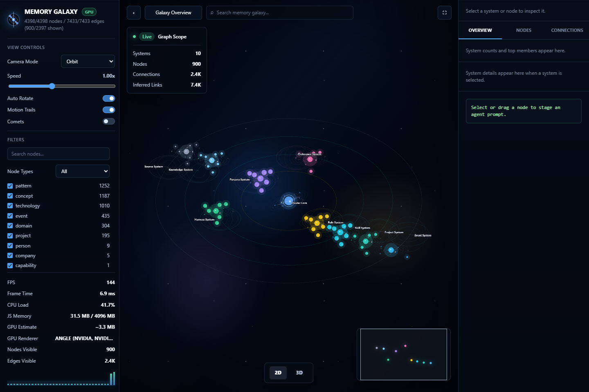
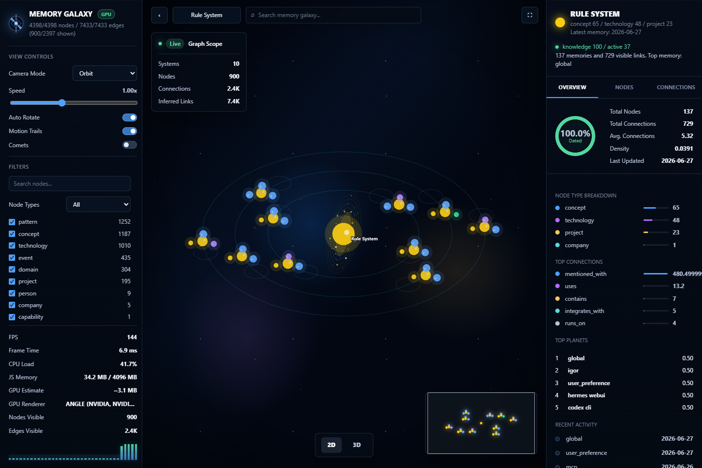
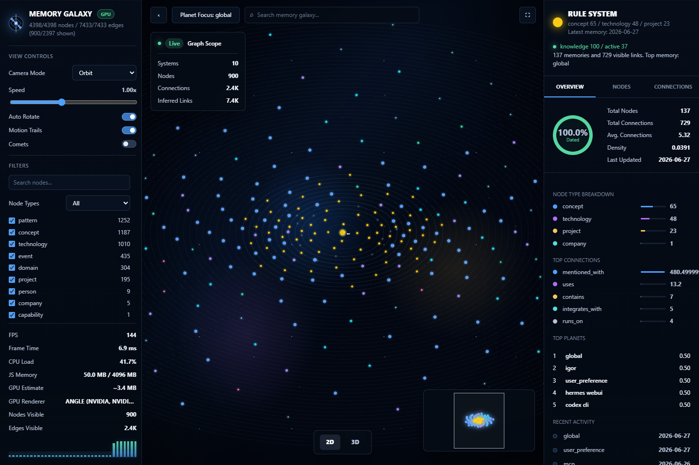

# Memnex

**语言：** [English](README.md) | 简体中文

**仓库：** [LLK-LL/Memnex](https://github.com/LLK-LL/Memnex)

Memnex 是一个面向个人 AI agent 的本地优先记忆库。它帮助 Codex、Claude、Cursor、MCP 工具和本地 agent 保存一次次工作中真正有价值的内容：记忆、规则、技能、偏好、工作流、导出和快照。

> AI 在一次任务里被你调教得越来越聪明，但下一次打开又像重新开始。

Memnex 会把这种脆弱的本地状态整理成可审查、可恢复、可迁移、可持续迭代的个人 AI 记忆系统。

**最新版本：** `v0.3.0` - Memory Galaxy 可视化工作台


## 它保存什么

Memnex 不是简单的聊天记录备份。它保存的是你使用 AI 时形成的操作层资产：

| 资产 | 保存内容 | 为什么重要 |
| --- | --- | --- |
| `memories/` | 事实、经验、决策、修复方法、反思记录 | 让 agent 长期记住真正有用的经验 |
| `rules/` | 行为规则和工作约束 | 告诉 agent 下次应该怎么做 |
| `skills/` | 可复用的 Codex skills 和任务流程 | 把成功流程变成可触发技能 |
| `agent-skills/` | 跨 agent 的技能层和路由器 | 在不同 agent 生态里复用工作流 |
| `preferences/` | 脱敏后的偏好和配置快照 | 保留稳定偏好，同时避开明显密钥 |
| `templates/` | 记忆、规则、技能迭代模板 | 让记忆系统可以被持续治理 |
| `manifest.json` | 同步来源和安全处理记录 | 记录每次收集了什么、何时收集、如何处理 |

## 使用前后对比

| 没有 Memnex | 使用 Memnex |
| --- | --- |
| 每次 AI 会话都从空白工作记忆开始。 | 下一次会话可以复用相关记忆、规则和技能。 |
| 调试经验散落在旧聊天里。 | 修复方法和教训变成文件化记忆资产。 |
| 提示词规则分散在多个客户端和项目中。 | 规则可版本化、可审查、可迁移。 |
| 本地记忆数据库时间久了变成黑箱。 | 记忆状态可以查看、对比、回滚和迁移。 |
| 个人工作流需要反复手动训练。 | 成功流程可以沉淀成可复用技能。 |

## v0.3.0 - Memory Galaxy 可视化工作台

Memnex 现在可以把抽象的本地记忆图谱变成一张可以飞进去看的星系图。新版 Memory Galaxy viewer 是一个本地浏览器工作台：每个记忆系统是一组星系，高优先级记忆像行星一样环绕，支撑事实和证据像卫星一样展开，关系链路可以被搜索、筛选、钻取和审查。

它仍然是本地优先的。导出器以 SQLite 只读模式打开源数据库，生成一个静态 viewer 目录；生成的 graph 数据默认不进入 Git。默认导出为全量图，不传 `--max-nodes` 或 `--max-edges` 时不会裁剪节点和边。

```powershell
python .\memory-system\tools\graph-viewer\export_graph_viewer.py `
  --db "$env:USERPROFILE\.tam\memory.db" `
  --output .\graph-viewer-output
```

打开 `graph-viewer-output\index.html` 查看全量 2D Memory Galaxy 工作台。

### 星系总览

总览视图把整个记忆系统映射成一张可导航的星系控制台。你可以搜索节点、过滤类型和层级、查看实时性能 HUD，并用右下角 minimap 快速跳转。



### 钻取到某个记忆系统

双击一个系统即可进入太阳系视图。系统中心变成恒星，相关记忆簇变成环绕行星；右侧 inspector 会展示数量、密度、近期活动和高权重连接。



### 查看局部上下文

继续双击某个行星，可以进入行星-卫星视图。直接邻居、派生上下文、证据和外部联系会分成不同轨道，方便你在复用记忆前理解它为什么和当前任务有关。



### v0.3.0 更新重点

- 新增 PixiJS Memory Galaxy UI，支持星系总览、太阳系钻取、行星-卫星局部图。
- 默认导出全量图；只有用户显式传入 `--max-nodes` 或 `--max-edges` 时才会限制规模。
- 支持搜索、节点类型过滤、边/层级过滤、面包屑、minimap 和 inspector tabs。
- 新增性能 HUD：FPS、帧耗时、内存估算、GPU renderer、可见节点/边数量。
- 导出器会嵌入 graph 数据并内联 viewer 模块，方便离线本地查看。
- 动画渲染已优化：动画 tick 更新现有对象，不再每帧重建场景。

生成的 viewer 目录可能包含私有记忆摘要。除非你已经专门审查并脱敏，否则不要公开真实导出结果；仓库中的截图只上传静态截图，不上传 `graph.json` 或数据库。

## Quick Start

Memnex 当前提供 Windows PowerShell 同步流程。

手动同步：

```powershell
powershell -NoProfile -ExecutionPolicy Bypass -File .\memory-system\scripts\sync-memory-library.ps1
```

安装每周自动同步任务：

```powershell
powershell -NoProfile -ExecutionPolicy Bypass -File .\memory-system\scripts\install-weekly-task.ps1
```

同步脚本会重建 `memory-data/current/`，复制经过允许的记忆相关来源，进行保守脱敏，生成 `memory-data/manifest.json`，并在有变化时提交和推送。

## 示例流程

```text
1. 完成一次真实的 AI 辅助任务。
2. 把有价值的经验、规则、命令或工作流保存到本地记忆层。
3. 运行 Memnex 同步脚本。
4. 审查生成的 memory-data/ 快照。
5. 让未来的 agent 检索相关记忆，而不是重新学习。
```

查看示例：

- [Codex 记忆同步](examples/codex-memory-sync.md)
- [Claude 适配](examples/claude-adapter.md)
- [Cursor Rules 适配](examples/cursor-rules.md)
- [MCP 记忆导出](examples/mcp-memory-export.md)

## 支持的 Agent 平台

Memnex 当前最适合 Codex + 本地 MCP 记忆生态，但它的存储方式本身是平台无关的。只要某个 agent 能读取 Markdown、规则文件、JSON 导出、本地文件或 MCP 工具，就可以把 Memnex 当成个人记忆来源。

| 平台 | 当前支持程度 | Memnex 提供什么 |
| --- | --- | --- |
| Codex CLI / Codex Desktop / Codex App | 原生 | `AGENTS.md`、`.codex/memories`、`.codex/rules`、`.codex/skills`、`.codex/templates`、脱敏配置快照 |
| VS Code / Cursor / Windsurf 中的 Codex | 原生 | 同一套 Codex 记忆、规则和技能层 |
| `.agents` 技能生态 | 原生 | `agent-skills/` 跨 agent 技能层 |
| MCP 记忆工具 / Total Agent Memory 风格导出 | 原生 | `memory-data/.../exports` 下的结构化记忆导出 |
| Claude Code / Claude Desktop | 易适配 | 长期记忆、规则、技能和工作流笔记，可转成 Claude 指令或 MCP 记忆 |
| Cursor | 易适配 | 项目约定、工作流规则、可复用任务指导，可转成 Cursor Rules |
| Continue / Windsurf / Cline | 易适配 | Markdown 上下文、规则、记忆和可选 MCP 检索 |
| OpenAI Agents SDK / LangGraph / LlamaIndex / AutoGen | 开发者集成 | 外部记忆源、检索工具、策略规则来源、技能注册表 |
| Obsidian / Khoj / 本地知识库工具 | 知识库集成 | 人类可读的长期笔记、模板和工作流记录 |

## Repository Layout

```text
memory-system/
  README.md
  scripts/
    sync-memory-library.ps1
    install-weekly-task.ps1
  tools/
    graph-viewer/

memory-data/
  current/
    exports/
    memories/
    rules/
    skills/
    agent-skills/
    preferences/
    templates/
  snapshots/
  manifest.json
```

## 隐私与安全

Memnex 默认保守处理公开边界。当前公开 release 排除 `memory-data/`，因此仓库只发布系统文件，而不会携带真实记忆内容。同步输出、graph viewer 导出、缓存、日志、临时文件和数据库中间文件都会被忽略。

偏好和配置快照会对敏感关键词做脱敏，例如：

- `token`
- `password`
- `secret`
- `api_key`
- `credential`
- `cookie`
- `session`

如果你要公开仓库，仍然建议先人工审查第一次同步结果。更多说明见 [安全与脱敏](docs/security-and-redaction.md)。

## Roadmap

- 增加 macOS/Linux 同步脚本。
- 增加端到端记忆同步流程 demo。
- 增加轻量级记忆、规则、技能检索 helper。
- 增加 Claude、Cursor、Continue、Windsurf、Cline 和 MCP server 适配示例。
- 增加跨平台脱敏和同步路径检查。

## 贡献

Memnex 仍处在早期，并且刻意保持小而清晰。适合贡献的内容包括：适配示例、脱敏改进、跨平台同步支持，以及真实 agent 工作流文档。

查看 [CONTRIBUTING.md](CONTRIBUTING.md) 了解当前贡献方式。

## 一句话总结

**Memnex 是给个人 AI 用户准备的轻量级本地记忆库：它把你的经验、偏好、规则和技能沉淀成可审查、可迁移、可持续迭代的 AI 记忆系统。**
