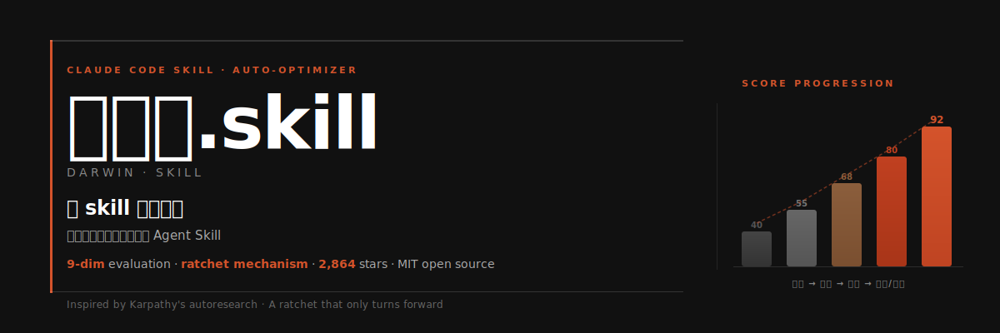
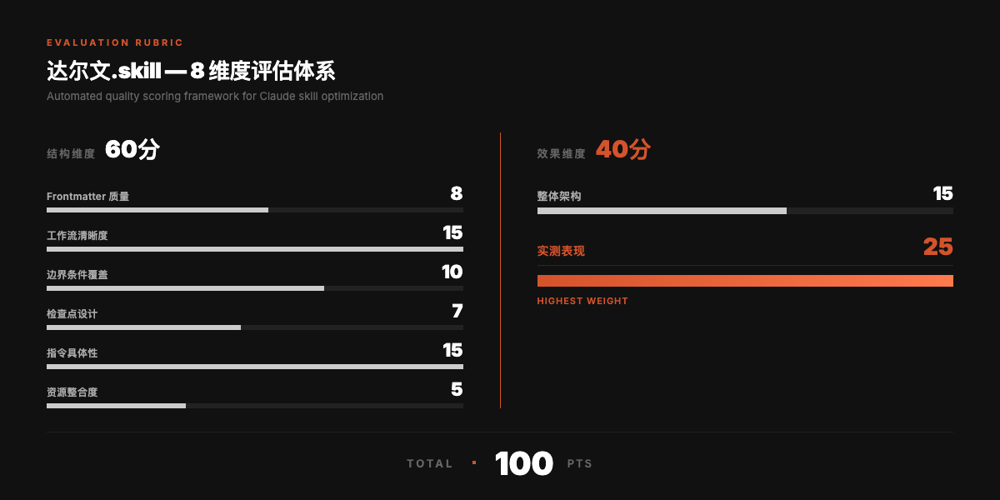
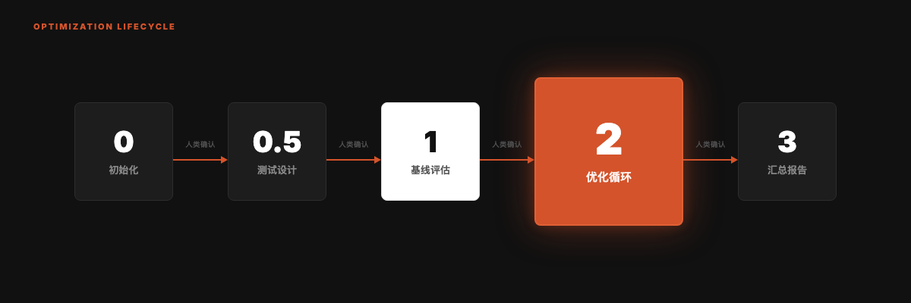

<div align="right">

**[English](README_EN.md)** | 涓枃

</div>



<p align="center">
  
  <br/>
  <sub>鍔ㄧ敾鐢?<a href="https://github.com/alchaincyf/huashu-design">huashu-design</a> skill 鍒朵綔</sub>
</p>

<div align="center">

# 杈惧皵鏂?skill 2.0

**鍍忚缁冩ā鍨嬩竴鏍蜂紭鍖栦綘鐨?Agent Skills銆?*

鍙?[Andrej Karpathy 鐨?autoresearch](https://github.com/karpathy/autoresearch) 鍚彂锛屽皢鑷富瀹為獙寰幆浠庢ā鍨嬭缁冩惉鍒?Skill 浼樺寲棰嗗煙銆備竴涓彧鑳藉悜鍓嶈浆鐨勬杞€?
**v2.0** 路 鏇存柊浜?2026-05-28 路 鍚告敹寰蒋鐮旂┒闄?[SkillLens](https://arxiv.org/abs/2605.23899) 涓?[SkillOpt](https://arxiv.org/abs/2605.23904) 涓ょ瘒璁烘枃鍋氱殑绯荤粺鎬у崌绾с€?
[](LICENSE)
[](#whats-new-in-20)
[](https://skills.sh)
[](https://skills.sh)
[](https://github.com/microsoft/SkillOpt)

```
npx skills add alchaincyf/darwin-skill
```

</div>

---

> [!NOTE]
> **馃 寰蒋鐮旂┒闄㈡妸杈惧皵鏂囧垪杩涗簡 SkillOpt 鐨勫畼鏂归泦鎴愬悕鍗曘€?*
> 2026-06-03锛屽井杞湪 [SkillOpt 浠撳簱](https://github.com/microsoft/SkillOpt) 鐨勬洿鏂伴噷鍐欓亾锛?> *銆実brain, gbrain-evals, and **darwin-skill** have all integrated SkillOpt.銆?
> 鎴戜滑鍚告敹浜嗗畠鐨?validation-gated 妗嗘灦锛屽畠鎶婅揪灏旀枃鍐欒繘浜嗚嚜宸辩殑闆嗘垚鍚嶅崟銆傝繖鏄竴娆″弻鍚戠殑鑷存剰銆傪煈?[鍘?SkillOpt 浠撳簱鐪嬬湅](https://github.com/microsoft/SkillOpt)

---

## What's New in 2.0

2.0 涓嶆槸缂濈紳琛ヨˉ锛屾槸绯荤粺鎬у惛鏀跺井杞爺绌堕櫌 2026-05-22 涓ょ瘒璁烘枃鍚庣殑缁撴瀯鎬у崌绾с€備簲涓彉鍖栵細

**1. 璇勫垎鏍囧噯 8 缁?鈫?9 缁?*锛堝惛鏀?[SkillLens](https://arxiv.org/abs/2605.23899) 瀹炶瘉鐨?73.8% rubric 鑽柟锛?
- 鍘熴€岄敊璇鐞嗐€嶇淮搴﹀崌绾т负 **澶辫触妯″紡缂栫爜** (Failure Mechanism Encoding)锛氫笉鍙槸銆屽憡璇?agent 鍒姱閿欍€嶏紝鑰屾槸鎶婂凡鐭ュけ璐ヨ矾寰勬樉寮忕紪鐮佽繘 skill
- 鍘熴€屾槑纭€с€嶇淮搴﹀崌绾т负 **鍙墽琛屽叿浣撴€?* (Actionable Specificity)锛氭槑鏂囩姝€屽缓璁?鍙互鑰冭檻/鏍规嵁鎯呭喌/鐏垫椿鎶婃彙/瑙嗘儏鍐佃€屽畾銆嶇瓑妯＄硦璇?- 鏂板绗節缁?**楂橀闄╄鍔ㄩ粦鍚嶅崟** (High-Risk Action Blacklist)锛歳m/git reset --hard/force push 绛夌牬鍧忔€ф搷浣滃繀椤诲湪 skill 涓樉寮忓垪绂?
**2. 楠岃瘉鏈哄埗瀵归綈 SkillOpt 鐨?validation-gated 璁捐**

- 澶氳瘎濮旂嫭绔嬪鏌ワ細姣忚疆鍚姩 2 涓嫭绔嬭瘎濮?- 璇勫涓嶅鐢細涓嬩竴杞惎鍔ㄥ叏鏂拌瘎濮旓紝閬垮厤閿氬畾鏁堝簲
- 鏃╁仠鏈哄埗锛氬崟杞定骞?< 1 鍒嗚嚜鍔ㄥ仠鎵嬶紝閬垮厤鍑戝垎鍫嗗啑浣?- 骞茶窇妯″紡鎺у埗锛氬共璺戞瘮渚?> 30% 鑷姩鍛婅

**3. Human in the Loop 涓夊眰瀹堝叧**锛堣揪灏旀枃鍖哄埆浜?SkillOpt 鍏ㄨ嚜鍔ㄨ璁＄殑鏍稿績锛?
- Phase 1 鍩虹嚎璇勪及锛氳嚜鍔?+ 浜哄伐瀹℃姤鍛婏紝鍐冲畾鏀逛粈涔?- Phase 2 鍗曠淮搴︿紭鍖栵細馃敶 CHECKPOINT 寮哄埗鏆傚仠锛岀瓑鐢ㄦ埛纭
- Phase 2.5 娴嬭瘯鎻愮ず璇嶈窇锛堝彲閫夛級
- Phase 3 鍥炲綊娴嬭瘯锛氿煕?STOP 娑ㄥ箙浣庝簬闃堝€煎己鍒跺仠鎵?
**4. 鍙嶄緥榛戝悕鍗?8 鏉?*锛堟槑鏂囩姝㈢殑鍙嶆ā寮忥級

1. 鍚屼竴涓?AI 鍙堟敼鍙堣瘎锛圫killLens 瀹炶瘉锛歀LM 鑷瘎鍑嗙‘鐜囦粎 46.4%锛?2. 鐢?`git reset --hard` 褰撳洖婊氭墜娈碉紙搴旂敤 `git revert`锛?3. 涓哄噾鍒嗚€屽爢鍐椾綑
4. 璺宠繃娴嬭瘯鎻愮ず璇嶇洿鎺ヨ瘎鍒?5. 涓€杞唴鏀瑰涓淮搴?6. 骞茶窇姣斾緥 > 30%
7. 闈欓粯璺宠繃寮傚父
8. 蹇借缁村害鐩稿叧绨?
**5. 瀹炴祴楠岃瘉鏁版嵁**

- huashu-gpt-image skill锛?*80.8 鈫?91.5 鈫?91.65**锛?10.85锛? 涓嫭绔嬭瘎濮斿叡璇嗭級
- darwin-skill 鑷瘎锛?*86.05 鈫?92.05 鈫?92.7**

---

## 鏍稿績寰幆


---

## 涓轰粈涔堝仛杩欎釜

Agent Skill 鐢熸€佸湪蹇€熸墿寮犮€侰laude Code銆丆odex銆丱penClaw銆乀rae銆丆odeBuddy 绛夊伐鍏烽兘鏀寔 SKILL.md 鏍煎紡銆傚綋浣犳湁 10 涓?Skills 鏃跺彲浠ユ墜鍔ㄧ淮鎶わ紱褰撲綘鏈?60+ 涓?Skills 鏃讹紝浣犻渶瑕佷竴涓郴缁熴€?
浼犵粺鐨?Skill 瀹℃煡鏄?*绾粨鏋勬€х殑**锛氭鏌ユ牸寮忓涓嶅銆佹楠ゆ湁娌℃湁缂栧彿銆佽矾寰勮兘涓嶈兘璁块棶銆備絾涓€涓牸寮忓畬缇庣殑 Skill锛岃窇鍑烘潵鐨勬晥鏋滃彲鑳藉緢宸€?
杈惧皵鏂?skill 鍚屾椂璇勪及**缁撴瀯璐ㄩ噺**鍜?*瀹為檯鏁堟灉**锛岀劧鍚庡彧淇濈暀鐪熸鏈夋敼杩涚殑淇敼銆?
---

## 浠?autoresearch 鍒?Skill Optimizer

杩欎釜椤圭洰鐩存帴鍙?Karpathy autoresearch 鍚彂銆俛utoresearch 鐨勫仛娉曟槸锛氬啓涓€涓?`program.md` 瀹氫箟鐩爣鍜岀害鏉燂紝璁?agent 鑷富鐢熸垚鍜屾祴璇曚唬鐮佸彉鏇达紝鍙繚鐣欏彲娴嬮噺鐨勬敼杩涖€?
鎴戜滑鎶婂悓鏍风殑鎬濊矾鎼埌浜?Skill 浼樺寲锛?
| autoresearch | 杈惧皵鏂?skill | 涓轰粈涔堣繖鏍锋槧灏?|
|:---|:---|:---|
| `program.md` | 鏈?SKILL.md | 瀹氫箟璇勪及鏍囧噯鍜岀害鏉熻鍒?|
| `train.py` | 姣忎釜寰呬紭鍖栫殑 SKILL.md | 琚紭鍖栫殑璧勪骇锛屾瘡娆″疄楠屽彧鏀瑰畠 |
| `val_bpb` | 9 缁村姞鏉冩€诲垎锛堟弧鍒?100锛?| 鍙噺鍖栫殑浼樺寲鐩爣 |
| `git ratchet` | keep / revert 鏈哄埗 | 鍙繚鐣欐湁鏀硅繘鐨?commit |
| `test set` | test-prompts.json | 楠岃瘉鏀硅繘鏄惁鐪熺殑鏈夋晥 |
| 鍏ㄨ嚜涓昏繍琛?| **浜哄湪鍥炶矾** | Skill 鐨勫ソ鍧忔瘮 loss 鏇村井濡欙紝闇€瑕佷汉鐨勫垽鏂?|

---

## 浜旀潯鏍稿績鍘熷垯

| # | 鍘熷垯 | 璇存槑 |
|:---|:---|:---|
| 01 | **鍗曚竴鍙紪杈戣祫浜?* | 姣忔鍙敼涓€涓?SKILL.md锛屽彉閲忓彲鎺э紝鏀硅繘鍙綊鍥?|
| 02 | **鍙岄噸璇勪及** | 缁撴瀯璇勫垎锛堥潤鎬佸垎鏋愶級+ 鏁堟灉楠岃瘉锛堣窇娴嬭瘯鐪嬭緭鍑猴級 |
| 03 | **妫樿疆鏈哄埗** | 鍙繚鐣欐敼杩涳紝鑷姩鍥炴粴閫€姝ワ紝鍒嗘暟鍙崌涓嶉檷 |
| 04 | **鐙珛璇勫垎** | 璇勫垎鐢ㄥ瓙 agent锛岄伩鍏嶃€岃嚜宸辨敼鑷繁璇勩€嶇殑鍋忓樊锛圫killLens 瀹炶瘉 LLM 鑷瘎浠?46.4% 鍑嗙‘鐜囷級 |
| 05 | **浜哄湪鍥炶矾** | 姣忎釜 Skill 浼樺寲瀹屽悗鏆傚仠锛岀敤鎴风‘璁ゅ啀缁х画涓嬩竴涓?|

---

## 9 缁村害璇勪及浣撶郴

鎬诲垎 100銆傜粨鏋勭淮搴﹂潬闈欐€佸垎鏋愶紝鏁堟灉缁村害蹇呴』瀹炴祴銆倂2.0 鏂板涓変釜缁村害鐩存帴鏉ヨ嚜 SkillLens 璁烘枃鐨勫疄璇?rubric銆?


鏂板鐨勪笁涓淮搴︼紙SkillLens 73.8% rubric 鑽柟锛夛細

| 缁村害 | 璇存槑 |
|:---|:---|
| **澶辫触妯″紡缂栫爜** | 鏄惧紡缂栫爜宸茬煡澶辫触璺緞锛屼笉鏄畝鍗曘€屽埆鐘敊銆嶅紡鍙槺 |
| **鍙墽琛屽叿浣撴€?* | 绂佺敤銆屽缓璁?鍙互鑰冭檻/鏍规嵁鎯呭喌/鐏垫椿鎶婃彙/瑙嗘儏鍐佃€屽畾銆嶇瓑妯＄硦鎺緸 |
| **楂橀闄╄鍔ㄩ粦鍚嶅崟** | rm / git reset --hard / force push 绛夌牬鍧忔€ф搷浣滃繀椤绘槑鏂囧垪绂?|

> 瀹炴祴琛ㄧ幇鏉冮噸鏈€楂樸€係kill 鍐欏緱鍐嶆紓浜紝璺戝嚭鏉ユ晥鏋滀笉濂藉氨鏄浂銆?
---

## 浼樺寲寰幆锛? 涓樁娈?
绯荤粺鍦ㄦ瘡涓樁娈靛唴鑷富杩愯锛屼絾鍦ㄩ樁娈典箣闂存殏鍋滅瓑寰呬汉绫荤‘璁ゃ€?


**Phase 2 鐨勬牳蹇冮€昏緫**锛坴2.0 寮哄寲锛夛細

1. 鎵惧嚭寰楀垎鏈€浣庣殑缁村害
2. 閽堝璇ョ淮搴︾敓鎴?1 涓叿浣撴敼杩涙柟妗堬紙涓€杞彧鏀逛竴涓淮搴︼紝鍙嶄緥榛戝悕鍗曠 5 鏉★級
3. 缂栬緫 SKILL.md锛実it commit
4. 鍚姩 **2 涓嫭绔嬪瓙 agent** 閲嶆柊璇勫垎锛堜笅涓€杞崲鍏ㄦ柊璇勫锛岄伩鍏嶉敋瀹氾級
5. 鏂板垎 > 鏃у垎 鈫?淇濈暀锛涘惁鍒?鈫?`git revert`锛堢鐢?`git reset --hard`锛屽弽渚嬮粦鍚嶅崟绗?2 鏉★級
6. 鍗曡疆娑ㄥ箙 < 1 鍒?鈫?鑷姩鏃╁仠锛堥伩鍏嶅噾鍒嗗爢鍐椾綑锛?7. 馃敶 CHECKPOINT 鏆傚仠锛屽睍绀?diff + 鍒嗘暟鍙樺寲锛岀瓑鐢ㄦ埛纭

---

## 妫樿疆鏈哄埗

鍒嗘暟鍙兘涓婂崌銆傛瘡涓€杞涔堟敼杩?Skill锛岃涔堝共鍑€鍦板洖婊氥€備笉浼氶殢鏃堕棿绉疮灞€閮ㄩ€€鍖栥€?


杞 2 鐨?75 鍒嗕綆浜庡綋鍓嶆渶浼樼殑 78 鍒嗭紝琚嚜鍔ㄥ洖婊氥€傛湁鏁堝熀绾垮缁堥攣瀹氬湪 78锛屽悗缁敼杩涗粠 78 缁х画銆?
---

## 蹇€熷紑濮?
```bash
npx skills add alchaincyf/darwin-skill
```

瀹夎鍚庡湪浠讳綍鏀寔 Skill 鐨?Agent 宸ュ叿涓銆屼紭鍖栨墍鏈塻kills銆嶆垨銆屼紭鍖栨煇涓猻kill銆嶅氨琛屻€?
鏃犳硶璁块棶 GitHub 鐨勬湅鍙嬶紝鍙互鐩存帴涓嬭浇 zip 鍖咃細[darwin-skill.zip](https://pub-161ae4b5ed0644c4a43b5c6412287e03.r2.dev/skills/darwin-skill.zip)锛岃В鍘嬪悗鎶?SKILL.md 鏀惧埌 `~/.claude/skills/darwin-skill/` 鐩綍鍗冲彲銆?
---

## 璁捐鐏垫劅

杩欎釜椤圭洰鐨勮璁＄洿鎺ュ彈 **Andrej Karpathy 鐨?[autoresearch](https://github.com/karpathy/autoresearch)** 鍚彂銆?
鏍稿績鏈哄埗瀹屽叏鐩稿悓锛?*鍙繚鐣欏彲娴嬮噺鐨勬敼杩涳紝鍏朵綑鍏ㄩ儴鍥炴粴銆?*

v2.0 鍦ㄦ鍩虹涓婂惛鏀朵簡寰蒋鐮旂┒闄?2026-05-22 鍙戝竷鐨勪袱绡囪鏂囷細[SkillLens](https://arxiv.org/abs/2605.23899) 鎻愪緵浜嗗疄璇侀獙璇佺殑 rubric 璁捐锛孾SkillOpt](https://arxiv.org/abs/2605.23904) 鎻愪緵浜?validation-gated edits 鐨勫舰寮忓寲妗嗘灦銆?
---

## References & Credits

v2.0 鐨勮璁＄洿鎺ュ熀浜庝互涓嬪鏈伐浣溿€傚己鐑堟帹鑽?skill 鐢熸€佺殑鐮旂┒鑰呭拰宸ョ▼甯堥槄璇伙細

### SkillLens

> Microsoft Research. *From Raw Experience to Skill Consumption: A Systematic Study of Model-Generated Agent Skills.* arXiv:2605.23899, 2026.

- 璁烘枃锛歨ttps://arxiv.org/abs/2605.23899
- **璐＄尞**锛氬疄璇侀獙璇佺殑 73.8% rubric 鑽柟銆傝揪灏旀枃.skill v2.0 鐨勪笁涓柊缁村害锛團ailure Mechanism Encoding / Actionable Specificity / High-Risk Action Blacklist锛夌洿鎺ユ潵鑷璁烘枃銆傚悓鏃朵篃鏄€屽悓涓€涓?AI 鍙堟敼鍙堣瘎銆嶅弽妯″紡鐨勫疄璇佹潵婧愨€斺€擫LM 鑷瘎鍑嗙‘鐜囦粎 46.4%銆?
### SkillOpt

> Microsoft Research. *SkillOpt: Executive Strategy for Self-Evolving Agent Skills.* arXiv:2605.23904, 2026.

- 馃敆 **浠ｇ爜浠撳簱**锛歔github.com/microsoft/SkillOpt](https://github.com/microsoft/SkillOpt)锛坄pip install skillopt`锛寁0.1.0 宸蹭笂 PyPI锛?- 椤圭洰椤碉細https://microsoft.github.io/SkillOpt/
- 璁烘枃锛歨ttps://arxiv.org/abs/2605.23904
- **璐＄尞**锛歷alidation-gated edits 鐨勫舰寮忓寲妗嗘灦銆傛妸 skill 褰撲綔 frozen 妯″瀷鐨勩€屽閮ㄥ彲璁粌鐘舵€併€嶏紝姣忔缂栬緫閮藉繀椤婚€氳繃鐙珛楠岃瘉鎵嶈兘淇濈暀銆傝揪灏旀枃.skill v2.0 鐨勫璇勫鐙珛瀹℃煡銆佽瘎濮斾笉澶嶇敤銆佹棭鍋滄満鍒躲€佸共璺戞瘮渚嬫帶鍒堕兘瀵归綈浜嗚妗嗘灦銆?- 馃 **鍙屽悜鍗拌瘉**锛?026-06-03锛孲killOpt 瀹樻柟浠撳簱鎶?darwin-skill 鍐欒繘浜嗛泦鎴愬悕鍗曪紝鍘熸枃鏄?*"gbrain, gbrain-evals, and darwin-skill have all integrated SkillOpt."* 瀹冪粰鎴戜滑妗嗘灦锛屾垜浠粰瀹冨疄鎴橀獙璇併€?
### autoresearch

> Andrej Karpathy. *autoresearch.* GitHub repository, 2026.

- 浠ｇ爜锛歨ttps://github.com/karpathy/autoresearch
- **璐＄尞**锛氳揪灏旀枃.skill 1.0 鐨勫師濮嬬伒鎰熸潵婧愩€傛牳蹇冩満鍒讹紙program.md / train.py / val_bpb / git ratchet / test set锛夌殑鏄犲皠閫昏緫瀹屽叏缁ф壙鑷?autoresearch銆?
**杈惧皵鏂?vs SkillOpt 鐨勫叧閿尯鍒?*锛歋killOpt 鏄叏鑷富绯荤粺锛岃揪灏旀枃.skill 寮鸿皟 human-in-the-loop鈥斺€擲kill 鐨勫ソ鍧忔瘮 validation loss 鏇村井濡欙紝鍏抽敭闃舵锛堝熀绾胯瘎浼般€佸崟缁村害浼樺寲銆佸洖褰掓祴璇曪級寮哄埗鏆傚仠锛岃浜烘潵鍋氭渶缁堝垽鏂€?
---

## 鍏充簬浣滆€?
| | |
|:---|:---|
| 馃寪 瀹樼綉 | [bookai.top](https://bookai.top) 路 [huasheng.ai](https://www.huasheng.ai) |
| 饾晱 Twitter | [@AlchainHust](https://x.com/AlchainHust) |
| 馃摵 B绔?| [鑺卞彅](https://space.bilibili.com/14097567) |
| 鈻讹笍 YouTube | [@Alchain](https://www.youtube.com/@Alchain) |
| 馃摃 灏忕孩涔?| [鑺卞彅](https://www.xiaohongshu.com/user/profile/5abc6f17e8ac2b109179dfdf) |
| 馃挰 鍏紬鍙?| 寰俊鎼溿€岃姳鍙斻€?|

---

## 璁稿彲璇?
MIT

---

<div align="center">

**[濂冲ú](https://github.com/alchaincyf/nuwa-skill)** 閫?Skill銆?br>
**杈惧皵鏂?* 璁?Skill 杩涘寲銆?br><br>
*鍙繚鐣欐敼杩涳紝鏃堕棿灏辩珯鍦ㄤ綘杩欒竟銆?

<br>

MIT License 漏 [鑺卞彅 Huashu](https://github.com/alchaincyf)

</div>
